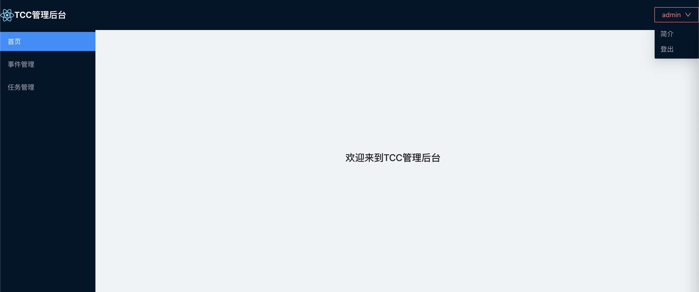
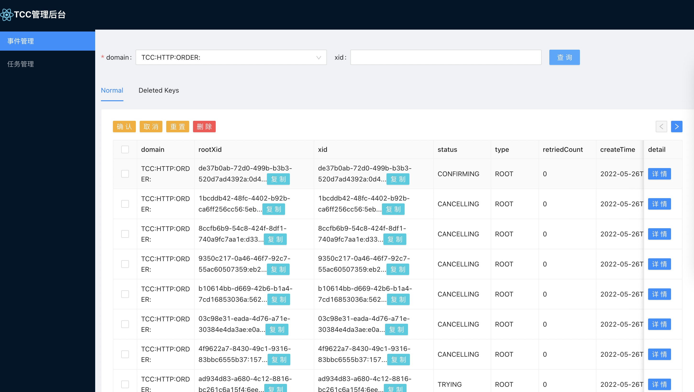
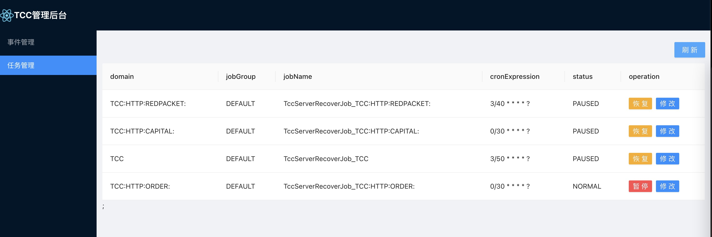

# 本地启动

## 1 启动服务tcc-transaction-server

## 2 启动服务tcc-transaction-dashboard

## 3 页面效果

### 访问地址
http://localhost:8888/tcc-transaction-dashboard
默认用户: admin 密码：123456    

### 登录功能
#### 登录页

#### 首页

### 事件管理

### 任务管理

  

# 版本说明
2.x版本，属于server模式，即客户端要和tcc服务端进行通讯调用
1.x版本，属于内嵌版本，不用和tcc服务端交互，带来的问题是
各有优劣，对于server模式，能够通过控制台查看事务情况，但增加了网络交互；对于内嵌版本，无需网络交互，但不易于查看事务执行历史等操作
推荐使用内嵌版本

